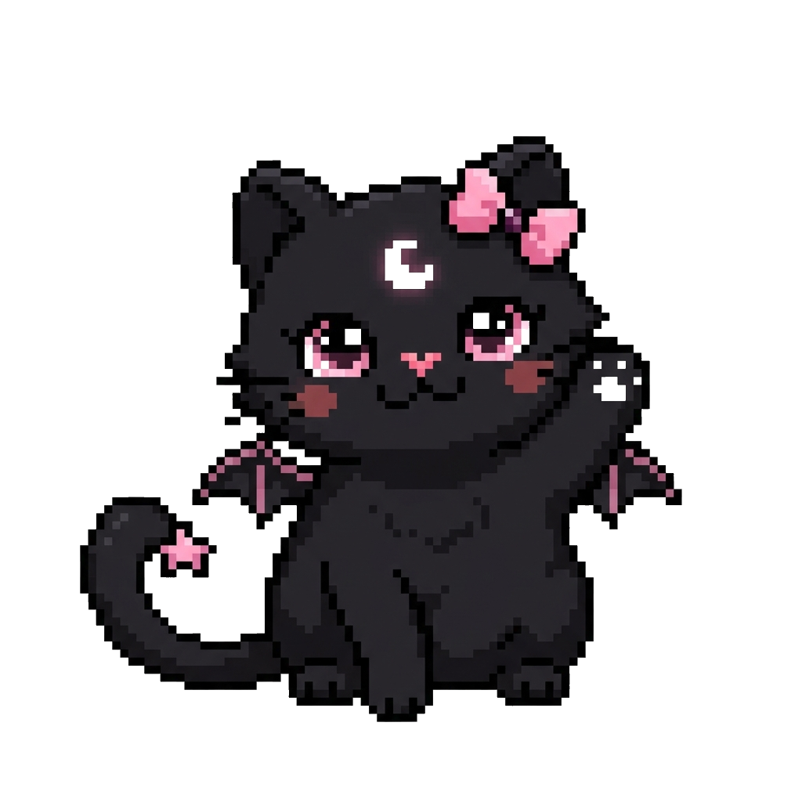

<div align="center">
  

  # 🦇 Catmoon Accessories 🌙

  **El lado cute de la oscuridad** 🖤✨  
  *Una landing page retro-futurista, kawaii-gótica inspirada en interfaces estilo Windows 95.*

  <p align="center">
    
    
    
    
  </p>
</div>

---

## 🔮 Sobre el Proyecto

**Catmoon** es una marca de accesorios alternativos para almas únicas. Esta landing page fue diseñada para capturar la esencia de la marca mediante una estética que combina elementos oscuros (góticos) con toques adorables (kawaii), envuelto en una nostálgica interfaz retro de **Windows 95**.

## ✨ Características (Features)

- 🖥️ **Diseño UI Win95:** Ventanas clásicas, botones retro, scanlines tipo monitor CRT y sombras pixeladas.
- 🎨 **Estética Kawaii-Gótico:** Paleta de colores cuidada con contrastes entre negro profundo, acentos rosados (`#FFD1DC`), y degradados.
- 💫 **Animaciones (AOS):** Animaciones de scroll fluidas (fade, flip) para revelar el contenido mágicamente.
- 🐈‍⬛ **Asistente Virtual:** Un CTA flotante de un gatito negro animado ("bounce") que invita a la interacción.
- 📱 **Responsividad Total:** Adaptado perfectamente para dispositivos móviles y escritorio usando Tailwind CSS.
- 🎆 **Sistema de Partículas:** Partículas brillantes flotantes en el fondo para mayor dinamismo.

## 🚀 Despliegue Local

Para correr este proyecto en tu entorno local:

1. Clona este repositorio:
   ```bash
   git clone https://github.com/rogelio888/catmoonlandingpage.git
   ```
2. Navega al directorio del proyecto:
   ```bash
   cd catmoonlandingpage
   ```
3. Abre el archivo `index.html` en tu navegador favorito, o usa una extensión como *Live Server* en VS Code.

## 🛠️ Tecnologías

- **Estructura:** HTML5 semántico
- **Estilos:** Tailwind CSS (vía CDN) + CSS Puro para efectos retro personalizados (Scanlines, sombras pixel art)
- **Interactividad:** Vanilla JavaScript
- **Librerías externas:**
  - Google Fonts (Epilogue, Space Grotesk, Be Vietnam Pro)
  - Google Material Symbols
  - [AOS (Animate On Scroll)](https://michalsnik.github.io/aos/)

<div align="center">
  <br/>
  <p><i>MANTENTE EXTRAÑA.</i> 🦇💕</p>
  <code>ALL_SYSTEMS_OPERATIONAL</code>
</div>
